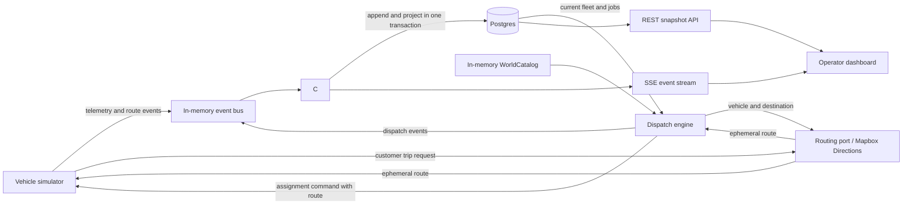

# Fleet Radar Architecture

This project is a take-home exercise for Vay, a remote-driving company. The objective is to build a small, operator-focused Fleet Radar while demonstrating full-stack delivery, event-driven thinking, real-time state handling, and pragmatic architectural choices. See `plans/ASSIGNMENT.md` for the original requirements, `plans/MAPBOX_INTEGRATION.md` for the Mapbox dependency and integration boundary, and `plans/FUTURE_WORK_AND_SCALING.md` for deferred capabilities and the operational changes required to grow from approximately 100 to 1,000 vehicles.

The implementation is deliberately a narrow end-to-end slice that can be completed and explained within the assignment timebox. A lightweight dispatch engine is part of that slice because dispatch is a real operational-system responsibility, not simulator behavior.

## Goals and Non-Goals

### MVP goals

- Simulate approximately 100 vehicles, including approximately 10 simultaneously in `EN_ROUTE` status.
- Display every vehicle's location, heading, battery percentage, required status, and data freshness.
- Display the current route for vehicles in `EN_ROUTE` status.
- Persist a bounded operating area and approximately 200 curated destinations, while retrieving route geometry ephemerally through Mapbox Directions.
- Update the dashboard as telemetry and route events arrive.
- Give an operator a clear map, fleet table, filters, legend, low-battery signal, and stale-data signal.
- Treat immutable telemetry and route events as the source of truth and maintain queryable current-state projections.
- Use a separate dispatch package to keep approximately 10 eligible vehicles `EN_ROUTE` through a replaceable assignment strategy.
- Run the complete application locally with Docker Compose.
- Preserve a clean boundary at which a simulated event source can be replaced by a Kafka consumer.

### MVP non-goals

- Running Kafka or reproducing Kafka's wire protocol, partitions, replication, consumer-group coordination, or offset storage.
- Production-grade dispatch optimization or teledriver scheduling.
- Charging-station workflows, field-agent dispatch, or customer-support workflows.
- Authentication and authorization, which the assignment explicitly excludes.
- A historical business-intelligence dashboard.
- Production deployment or production-scale infrastructure.

## System Context and Data Flow

The operating area, service zones, and approximately 200 curated destinations are persisted, repository-owned world data. Route geometry is deliberately not persisted: customer trips and dispatch assignments request an ephemeral route from Mapbox Directions at runtime. The simulator and event-source adapter represent the external vehicle/Kafka environment. Dispatch, event consumption, projections, APIs, and the dashboard are operational-system responsibilities.



The browser first loads a consistent snapshot over REST and then applies deltas from a Server-Sent Events stream. SSE is preferred over WebSockets because communication is primarily server-to-browser and automatic reconnection is useful. On an unrecoverable gap or server restart, the browser reloads the snapshot.

## Event-Driven Boundary

Kafka is not required to run for this assignment. The application defines the smallest transport-independent boundary it needs:

```ts
interface EventSource {
  subscribe(handler: (event: FleetEvent) => Promise<void>): Promise<() => Promise<void>>;
}

interface EventPublisher {
  publish(event: FleetEvent): Promise<void>;
}
```

The MVP uses an `InMemoryEventBus` implementing both ports with a small asynchronous queue or Node's built-in event primitives. This is not intended to simulate Kafka itself. It delivers typed records through transport-independent ports. The consumer, simulator, and dispatch engine must not depend on transport-specific metadata or on each other's concrete implementations.

Ownership is explicit rather than represented by a separate event-bus package:

- `packages/domain/src/events` owns the immutable event envelope and payload schemas, runtime validation, the `EventSource`, `EventPublisher`, and `FleetEventFactory` contracts, and the shared per-vehicle sequence allocator.
- `packages/simulation` and `packages/dispatch` publish their domain facts through those contracts. Neither imports the concrete bus or backend consumer.
- `apps/server/src/eventing` owns the `InMemoryEventBus`, consumer/projections, and composition wiring. A future Kafka adapter belongs here (or in a dedicated transport package only when its serialization, retry, configuration, and observability justify that boundary).

The in-memory adapter validates and takes an immutable transport copy before queuing each publish, so later producer mutation cannot change an accepted record. It delivers each accepted event to all subscribers in call order. A publish resolves after all current subscribers finish. If one or more handlers fail, all handlers are still attempted and the publish rejects explicitly; the failure does not poison later queued events. Unsubscribe is idempotent, stops future publications, and provides deterministic cleanup. These are intentionally documented application semantics, not an attempt to reproduce Kafka consumer groups or acknowledgements.

`FleetProjectionConsumer` is a process-local reference implementation for this initial slice. It assigns backend `receivedAt`, ignores duplicate event IDs, appends accepted records to an in-memory event log, and prevents stale telemetry sequences or route versions from replacing newer projections. The Postgres consumer replaces those collections with an append-and-project transaction without changing the producer contracts or transport boundary.

There is no mature, framework-neutral TypeScript package that provides a drop-in in-memory Kafka broker and is justified for this MVP. Kafka clients such as KafkaJS or `@confluentinc/kafka-javascript` still require a broker. `@nest-native/kafka` includes an in-memory test broker, but it is a pre-1.0 NestJS-specific integration and does not justify selecting NestJS for this project.

This boundary demonstrates the Kafka-relevant application behavior:

- Events are immutable and may be delivered at least once.
- Vehicle ID is the ordering key, preserving per-vehicle order.
- Event IDs make consumption idempotent.
- Per-vehicle sequence numbers prevent older telemetry from overwriting newer state.
- Events are validated at ingestion and invalid events fail explicitly.
- Current-state projections can be rebuilt from the event log.

## Event Model

Every event uses a common envelope:

```ts
type FleetEvent<TType extends string = string, TPayload = unknown> = {
  eventId: string;
  eventType: TType;
  schemaVersion: 1;
  vehicleId: string;
  sequence: number;
  occurredAt: string;
  correlationId?: string;
  payload: TPayload;
};
```

`receivedAt` is assigned by the backend rather than trusted from the producer. A dispatch job ID is used as the correlation ID across an assignment command and the events it causes.

MVP event types are:

- `vehicle.telemetry-received`: location, heading, battery percentage, and display status.
- `route.assigned`: application route ID, version, destination ID, and assignment state. Provider route geometry is transient and is not written to the event log.
- `route.updated`: a newer version of an active route.
- `route.cancelled`: the active route is no longer valid.
- `route.completed`: the vehicle has completed the route.
- `route.assignment-rejected`: the vehicle could not accept a dispatch assignment.
- `dispatch.assignment-requested`: the dispatcher selected a vehicle and route.
- `dispatch.assignment-completed`: the correlated route completed.

Route geometry is not repeated in telemetry events or persisted route events. It remains transient working state for the active movement and is discarded on completion. Route events and telemetry have independent timestamps and versions so the UI can distinguish stale vehicle data from stale route data.

### Data semantics

- Coordinates use WGS84 and GeoJSON order: `[longitude, latitude]`.
- Heading is degrees in the range `[0, 360)`, where `0` is north.
- Battery percentage is in the range `[0, 100]`.
- Event timestamps are ISO 8601 UTC timestamps.
- `sequence` is monotonically increasing per vehicle within a simulator run.
- The composition root shares one `FleetEventFactory` across simulator and dispatch publishers so their events use one per-vehicle sequence domain. It is not a database version or Kafka offset.
- `routeId` identifies a route assignment; `version` increases on route updates.
- Staleness is based on backend `receivedAt`, not producer clock time.

The MVP uses the assignment's `FREE | WITH_CUSTOMER | EN_ROUTE` display status.

## Simulation Engine

The simulator is a deterministic, parameterized state model and is external to the operational system. A seeded random-number generator makes runs and tests reproducible.

On each tick it:

1. Advances moving vehicles along their current route.
2. Updates heading and battery based on distance travelled.
3. Performs permitted state transitions.
4. Emits one telemetry event for each vehicle unless that vehicle is simulating a telemetry gap.
5. Emits route lifecycle events when assignments change or complete.

The simulator also implements a `VehicleCommandPort`. An assignment command contains a command ID, dispatch job ID, vehicle ID, application route ID, route version, destination ID, and ephemeral `PlannedRoute`. The simulator validates the vehicle's observed state and range at command time. It either retains the plan as active working state, starts movement, and emits `route.assigned`, or leaves the vehicle unchanged and emits `route.assignment-rejected`. This models the fact that a dispatch decision is a request to the vehicle domain rather than an immediate mutation of simulator internals.

The valid MVP display-status transitions are:

- `FREE -> WITH_CUSTOMER`: simulated customer demand starts a trip. The simulator follows a route, but that route is not shown as a remote-driving assignment.
- `WITH_CUSTOMER -> FREE`: the customer trip completes.
- `FREE -> EN_ROUTE`: only an accepted dispatch assignment command can start remote repositioning.
- `EN_ROUTE -> FREE`: the assigned route completes or is cancelled.
- `WITH_CUSTOMER <-> EN_ROUTE`: invalid; the MVP returns through `FREE`.

The simulator never chooses `EN_ROUTE` independently; this status always has an accepted dispatch job and route assignment. The dispatch engine, not the simulator, is responsible for maintaining the target number of active assignments.

Configuration is read from a small YAML or TOML file:

- Seed and number of vehicles.
- Tick interval and simulated time multiplier.
- Customer-trip probability and free-time range.
- Battery capacity, energy consumption per distance, and low-battery threshold.
- Telemetry-gap probability and maximum gap duration.
- Service-area, service-zone, and destination-data locations.

A lightweight demo recharge rule restores low-battery vehicles after a simulated delay so the fleet does not eventually become inert.

### Bounded simulation world

Implementation details for generating the Las Vegas metro assets are defined in `plans/BOUNDED_SIMULATION_WORLD_PLAN.md`.

The simulation runs inside one explicitly configured operating area rather than choosing arbitrary coordinates. Its persistent world data consists of:

- `service-area.geojson`: one WGS84 polygon defining valid simulation geography and the dashboard's initial and maximum map bounds.
- `service-zones.geojson`: named operational subdivisions used for coverage and filtering.
- `destinations.json`: approximately 200 curated stable destination IDs, display names, coordinates, and service-zone IDs. Coordinates must be inside the operating polygon and deliberately located on or near routable roads.

Vehicles initialize at destination coordinates. A `FREE` vehicle remains associated with its current destination. Customer trips and dispatch assignments choose another persisted destination and request a runtime route through `RoutingPort`. When a vehicle reaches the route endpoint, its current destination becomes the selected destination.

Two destinations per vehicle provide enough spatial variety that repositioning and customer trips do not repeatedly cycle through a tiny set of points. Startup validation fails with a clear error if destination data is invalid, a destination references a missing service zone, coordinates are duplicated beyond a configured tolerance, or a destination is outside the operating polygon. Destination data must be authored by the project or obtained from a source whose license permits persistence; temporary Mapbox Geocoding results may not be stored.

The simulator interpolates position, heading, distance, and energy consumption along the ephemeral `LineString` returned for an accepted trip. If Directions returns `NoRoute`, `NoSegment`, times out, or is rate-limited, the transition is rejected and the vehicle remains `FREE`; a bounded retry may select another destination. The simulator never invents an arbitrary coordinate or falls back to a straight line that contradicts the displayed route.

### Runtime routing

Both customer trips and dispatch assignments depend on a transport-neutral routing port:

```ts
interface RoutingPort {
  planRoute(origin: Position, destination: Destination): Promise<PlannedRoute>;
}

type PlannedRoute = {
  geometry: GeoJSON.LineString;
  distanceMeters: number;
  durationSeconds: number;
};
```

The MVP adapter calls Mapbox Directions with the `mapbox/driving` profile, `geometries=geojson`, and an appropriate overview. `PlannedRoute` is active working state, not durable data. The composition root places it in an in-memory `ActiveRouteStore`, passes it to the simulator in the assignment command, and exposes it to the browser while that route is active. It is removed when the route completes or is cancelled.

Persisted route events and `route_current` keep only application-owned facts such as route ID, vehicle ID, origin coordinate or destination ID, destination ID, version, lifecycle state, and timestamps. They do not store Mapbox geometry, distance, duration, or the raw provider response. If active geometry is missing after a process restart, the adapter requests a new ephemeral route from the persisted endpoints.

Directions is called once per attempted trip or dispatch assignment, never once per telemetry tick. The adapter enforces a concurrency limit, a request timeout, bounded retries, the provider's rate limit, and an application-level monthly request budget. Accelerating simulated movement must not accelerate trip turnover past that request budget. Tests use a deterministic fake `RoutingPort`, not live Mapbox requests.

## Dispatch Engine

Dispatch is an MVP package and part of the operational system. It is not bundled into the simulator. The package runs in the same Node process for the local MVP and communicates through explicit ports.

The dispatch package owns:

- Dispatch-job creation and lifecycle.
- Selection of an eligible vehicle and destination through a configured strategy.
- Prevention of more than one active dispatch job per vehicle.
- Submission of idempotent assignment commands through `VehicleCommandPort`.
- Correlation of accepted, rejected, completed, and cancelled route events with jobs.
- Maintaining the configured target of approximately 10 active `EN_ROUTE` assignments.

It depends on abstractions owned by the dispatch package or shared domain package:

```ts
interface DispatchStrategy {
  select(context: DispatchContext): DispatchDecision | null;
}

interface FleetStateReader {
  getDispatchContext(): Promise<DispatchContext>;
}

interface DispatchJobRepository {
  tryCreate(decision: DispatchDecision): Promise<DispatchJob | null>;
}

interface VehicleCommandPort {
  assignRoute(command: AssignRouteCommand): Promise<void>;
}
```

`DispatchContext` is an immutable snapshot containing eligible vehicle state, active jobs, service-zone coverage, destinations from the in-memory `WorldCatalog`, and configuration. `DispatchDecision` identifies a vehicle and destination and may include a machine-readable reason. A strategy proposes a decision; the engine remains responsible for obtaining a route through `RoutingPort`, checking range, persistence through `DispatchJobRepository`, command idempotency, event publication, and lifecycle handling. `tryCreate` and the database uniqueness constraint resolve races between dispatch cycles.

The MVP uses `RandomDispatchStrategy`. On a configurable interval, the engine compares active accepted jobs with its target, chooses randomly among `FREE`, fresh, sufficiently charged vehicles without an active job, and selects a different persisted destination inside the operating area. The engine asks `RoutingPort` for an ephemeral route, verifies range from the returned distance, creates a job, and sends the command. The random generator is seeded so the candidate decision is reproducible; live Mapbox geometry is not expected to be byte-for-byte deterministic. Routing or command rejection returns the job to a terminal `REJECTED` state and permits another candidate on a later dispatch cycle.

The job lifecycle is `REQUESTED -> ACCEPTED -> IN_PROGRESS -> COMPLETED`, with `REJECTED`, `CANCELLED`, and `FAILED` alternatives. Job state is distinct from vehicle display status. The strategy is selected by configuration from an explicit registry; dynamic plug-in loading or a generic rules framework is unnecessary for the MVP.

MVP dispatch configuration includes the strategy name, target active assignments, dispatch interval, seeded-random configuration, and maximum new jobs per cycle.

## Data Backend

Postgres is the durable store. PostGIS is not required because the MVP does not perform database-backed spatial queries.

The minimum tables are:

### `event_log`

An append-only record of accepted events with `event_id`, event type, schema version, vehicle ID, sequence, occurred time, received time, and JSON payload. `event_id` is unique for idempotency. The event log is the replayable source of truth.

### `vehicle_current`

One current row per vehicle containing location, heading, battery, display status, last sequence, last occurred time, and last received time. An event only updates this projection when its sequence is newer than the stored sequence.

### `route_current`

At most one active route record per vehicle, including application route ID, version, origin coordinate or destination ID, destination ID, lifecycle state, and update time. Mapbox geometry, distance, duration, and raw responses are not persisted. A route update only applies when its version is newer than the stored version.

### `dispatch_job`

One row per dispatch attempt containing job ID, vehicle ID, route ID and version, strategy name, lifecycle state, decision reason, command ID, correlation ID, and timestamps. A partial unique constraint prevents more than one active job per vehicle. Dispatch-job history supports operator visibility.

The consumer validates an event, appends it to `event_log`, and updates the relevant projection in one database transaction. A duplicate event is acknowledged without changing state. Projection-rebuild code can truncate derived tables and replay the log in event order.

Database views are reserved for stable domain calculations such as zone coverage. REST response shapes, UI widgets, and ad hoc presentation calculations should not each become database views.

## API and Real-Time Updates

Minimum endpoints are:

- `GET /api/vehicles`: current vehicle snapshot, with active route summaries where applicable.
- `GET /api/vehicles/:vehicleId`: vehicle details plus active ephemeral route geometry when available.
- `GET /api/dispatch-jobs`: active and recent dispatch jobs.
- `GET /api/events`: SSE stream of accepted vehicle, route, and dispatch projection updates.
- `GET /health`: application and database readiness.

SSE messages include an event ID and only the changed projection. The backend may coalesce updates over a short interval if the simulator runs faster than the browser should render. The browser applies updates to an indexed client-side collection and updates Mapbox data in batches rather than rendering one React/DOM marker per vehicle.

There are no public mutation endpoints in the MVP.

## Operator Dashboard

The MVP is one coherent operator view rather than separate operational and business dashboards:

- Mapbox map with vehicle symbols, heading, status color, and stale styling.
- Route overlay for the selected `EN_ROUTE` vehicle, with a toggle for all active routes.
- Fleet table with vehicle ID, status, battery, freshness, and destination.
- Search and filters for status, low battery, and stale telemetry.
- Selected-vehicle detail panel with exact timestamps and route information.
- Legend and KPI strip for `FREE`, `WITH_CUSTOMER`, `EN_ROUTE`, low-battery, and stale counts.
- Compact dispatch queue showing requested, active, rejected, and recently completed jobs.
- Predefined service-zone overlay showing `FREE` vehicle count versus a configurable target.

Staleness must be conspicuous and must not silently present an old location as live. Coverage is calculated over named operational zones rather than arbitrary empty map cells.

## Infrastructure

- TypeScript for simulator, backend, shared event schemas, and frontend.
- A lightweight Node HTTP framework and schema validation library; framework selection should favor delivery speed and readable code.
- React with Mapbox GL JS for basemap rendering, camera controls, and client-side GeoJSON layers in the dashboard.
- Postgres without PostGIS.
- Dockerfiles for application services and Docker Compose for reproducible local orchestration.
- Environment variables for database credentials, the Mapbox browser token, the server-side Directions token, and the Directions request budget; `.env.example` contains names and safe placeholders only.

The TypeScript workspace is separated by responsibility:

- `packages/domain`: shared event schemas, commands, identifiers, and transport-neutral types.
- `packages/world`: validated, immutable bounded-world assets and the in-memory `WorldCatalog`.
- `packages/simulation`: vehicle state model, simulator-owned event publisher, and the simulated implementation of `VehicleCommandPort`.
- `packages/dispatch`: dispatch engine, strategy contract, random MVP strategy, job rules, and its required ports.
- `apps/server`: composition root, Mapbox Directions adapter, transient active-route store, in-memory event bus, event consumer, Postgres projections, REST, and SSE.
- `apps/web`: React operator dashboard and the initial Mapbox world-preview spike.

Package boundaries prevent dispatch from importing simulator state or mutating vehicles directly. Running them in one server process is an MVP deployment choice, not a domain coupling.

Mapbox has two explicit integration points. Mapbox GL JS renders a Mapbox-hosted basemap plus application-owned GeoJSON sources for the operating polygon, service zones, destinations, vehicles, headings, and active routes. Separately, the server's `RoutingPort` adapter calls Mapbox Directions once per attempted movement and keeps the response only as active in-memory working state. The database never persists Directions results. See `plans/MAPBOX_INTEGRATION.md` for the complete inventory and fallback behavior.

Mapbox browser tokens are necessarily visible to the browser. Use a least-privilege public token, configure localhost/deployment URL restrictions where practical, and never expose a secret token. Use a separate least-privilege Directions token in the server environment and never send it to the browser. The current Mapbox Product Terms prohibit caching or storing Directions API results, so route geometry remains ephemeral and is discarded after use.

Docker Compose is the local runtime contract.

## Testing

Tests should cover both happy paths and edge conditions:

- Valid and invalid simulator transitions.
- Deterministic movement, heading, battery depletion, and demo recharge.
- Validation and persistence of approximately 200 bounded destinations.
- Deterministic destination selection with a fake `RoutingPort`.
- Directions timeout, rate-limit, no-route, budget-exhaustion, and provider-degraded behavior.
- Proof that provider geometry, distance, duration, and raw responses never enter the database or event log.
- Required `EN_ROUTE` count and associated route presence.
- Deterministic random-strategy decisions and strategy selection by configuration.
- Dispatch eligibility, one-active-job-per-vehicle, target concurrency, command rejection, and retry on a later cycle.
- Dispatch job correlation across requested, accepted, completed, and rejected events.
- Event-schema validation.
- Duplicate and out-of-order event handling.
- Atomic event append and projection update.
- Route assignment, update, cancellation, and completion.
- Projection rebuild from the event log.
- Telemetry staleness after a simulated gap.
- REST snapshot and SSE update integration.
- A frontend smoke test for selection, filtering, and route display.

## Deliverables and Tradeoffs

The repository must include backend and frontend code, the bounded operating area and approximately 200 source-controlled destinations loaded in memory, Docker-based local-run instructions, configuration examples, test instructions, and a concise README describing the 100-vehicle data, runtime routing, dispatch flow, and explicit MVP non-goals.
