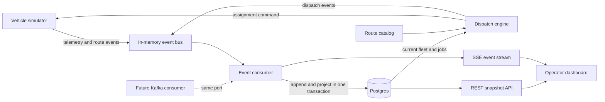

# Fleet Radar Architecture

This project is a take-home exercise for Vay, a remote-driving company. The objective is to build a small, operator-focused Fleet Radar while demonstrating full-stack delivery, event-driven thinking, real-time state handling, and pragmatic architectural choices. See `plans/ASSIGNMENT.md` for the original requirements.

The implementation is deliberately a narrow end-to-end slice that can be completed and explained within the assignment timebox. A lightweight dispatch engine is part of that slice because dispatch is a real operational-system responsibility, not simulator behavior. Charging, incidents, demand forecasting, and advanced dispatch policies remain extension points rather than partially implemented subsystems.

## Goals and Non-Goals

### MVP goals

- Simulate approximately 100 vehicles, including approximately 10 simultaneously in `EN_ROUTE` status.
- Display every vehicle's location, heading, battery percentage, required status, and data freshness.
- Display the current route for vehicles in `EN_ROUTE` status.
- Update the dashboard as telemetry and route events arrive.
- Give an operator a clear map, fleet table, filters, legend, low-battery signal, and stale-data signal.
- Treat immutable telemetry and route events as the source of truth and maintain queryable current-state projections.
- Use a separate dispatch package to keep approximately 10 eligible vehicles `EN_ROUTE` through a replaceable assignment strategy.
- Run the complete application locally with Docker Compose.
- Preserve a clean boundary at which a simulated event source can be replaced by a Kafka consumer.

### MVP non-goals

- Running Kafka or reproducing Kafka's wire protocol, partitions, replication, consumer-group coordination, or offset storage.
- Production-grade dispatch optimization or teledriver scheduling.
- Charging-station workflows, field-agent dispatch, or customer-support workflows.
- Authentication and authorization, which the assignment explicitly excludes.
- A historical business-intelligence dashboard.
- Production deployment or production-scale infrastructure.

These non-goals remain useful discussion topics and are covered under Future Work.

## System Context and Data Flow

The map area, service zones, destinations, and route geometries are static development assets. Precomputed GeoJSON routes keep the demo deterministic and avoid making runtime routing API calls. The simulator and event-source adapter represent the external vehicle/Kafka environment. Dispatch, event consumption, projections, APIs, and the dashboard are operational-system responsibilities.



The browser first loads a consistent snapshot over REST and then applies deltas from a Server-Sent Events stream. SSE is preferred over WebSockets because communication is primarily server-to-browser and automatic reconnection is useful. On an unrecoverable gap or server restart, the browser reloads the snapshot.

## Event-Driven Boundary

Kafka is not required to run for this assignment. The application defines the smallest transport-independent boundary it needs:

```ts
interface EventSource {
  subscribe(handler: (event: FleetEvent) => Promise<void>): Promise<() => Promise<void>>;
}

interface EventPublisher {
  publish(event: FleetEvent): Promise<void>;
}
```

The MVP uses an `InMemoryEventBus` implementing both ports with a small asynchronous queue or Node's built-in event primitives. This is not intended to simulate Kafka itself. It only delivers typed records through the same ports used by future Kafka adapters. The consumer, simulator, and dispatch engine must not depend on transport-specific metadata or on each other's concrete implementations.

There is no mature, framework-neutral TypeScript package that provides a drop-in in-memory Kafka broker and is justified for this MVP. Kafka clients such as KafkaJS or `@confluentinc/kafka-javascript` still require a broker. `@testcontainers/kafka` is a good future integration-test option, but it starts a real Kafka container. `@nest-native/kafka` includes an in-memory test broker, but it is a pre-1.0 NestJS-specific integration and does not justify selecting NestJS for this project. If protocol compatibility becomes a requirement, `kcat -M` or Testcontainers should be used instead of expanding the in-memory adapter into a home-grown broker.

This boundary demonstrates the Kafka-relevant application behavior:

- Events are immutable and may be delivered at least once.
- A vehicle ID is the future partition key, preserving per-vehicle order.
- Event IDs make consumption idempotent.
- Per-vehicle sequence numbers prevent older telemetry from overwriting newer state.
- Events are validated at ingestion and invalid events fail explicitly.
- Current-state projections can be rebuilt from the event log.

Consumer-group rebalancing, broker acknowledgements, offset commits, retention, and dead-letter topics are production concerns and should only be tested against a real Kafka-compatible broker.

## Event Model

Every event uses a common envelope:

```ts
type FleetEvent<TType extends string = string, TPayload = unknown> = {
  eventId: string;
  eventType: TType;
  schemaVersion: 1;
  vehicleId: string;
  sequence: number;
  occurredAt: string;
  correlationId?: string;
  payload: TPayload;
};
```

`receivedAt` is assigned by the backend rather than trusted from the producer. A dispatch job ID is used as the correlation ID across an assignment command and the events it causes.

MVP event types are:

- `vehicle.telemetry-received`: location, heading, battery percentage, and display status.
- `route.assigned`: route ID, version, destination, and GeoJSON `LineString`.
- `route.updated`: a newer version of an active route.
- `route.cancelled`: the active route is no longer valid.
- `route.completed`: the vehicle has completed the route.
- `route.assignment-rejected`: the vehicle could not accept a dispatch assignment.
- `dispatch.assignment-requested`: the dispatcher selected a vehicle and route.
- `dispatch.assignment-completed`: the correlated route completed.

Route geometry is not repeated in telemetry events. Route events and telemetry have independent timestamps and versions so the UI can distinguish stale vehicle data from stale route data.

### Data semantics

- Coordinates use WGS84 and GeoJSON order: `[longitude, latitude]`.
- Heading is degrees in the range `[0, 360)`, where `0` is north.
- Battery percentage is in the range `[0, 100]`.
- Event timestamps are ISO 8601 UTC timestamps.
- `sequence` is monotonically increasing per vehicle within a simulator run.
- `routeId` identifies a route assignment; `version` increases on route updates.
- Staleness is based on backend `receivedAt`, not producer clock time.

The MVP preserves the assignment's `FREE | WITH_CUSTOMER | EN_ROUTE` status. In a production domain model this value should be derived from independent concepts such as customer occupancy, control mode, service availability, energy state, connectivity, and incident state. Keeping these dimensions separate avoids forcing combinations such as customer support or low battery into a single state machine.

## Simulation Engine

The simulator is a deterministic, parameterized state model and is external to the operational system. A seeded random-number generator makes runs and tests reproducible.

On each tick it:

1. Advances moving vehicles along their current route.
2. Updates heading and battery based on distance travelled.
3. Performs permitted state transitions.
4. Emits one telemetry event for each vehicle unless that vehicle is simulating a telemetry gap.
5. Emits route lifecycle events when assignments change or complete.

The simulator also implements a `VehicleCommandPort`. An assignment command contains a command ID, dispatch job ID, vehicle ID, route ID, and route version. The simulator validates the vehicle's observed state and range at command time. It either starts movement and emits `route.assigned`, or leaves the vehicle unchanged and emits `route.assignment-rejected`. This models the fact that a dispatch decision is a request to the vehicle domain rather than an immediate mutation of simulator internals.

The valid MVP display-status transitions are:

- `FREE -> WITH_CUSTOMER`: simulated customer demand starts a trip. The simulator follows a route, but that route is not shown as a remote-driving assignment.
- `WITH_CUSTOMER -> FREE`: the customer trip completes.
- `FREE -> EN_ROUTE`: only an accepted dispatch assignment command can start remote repositioning.
- `EN_ROUTE -> FREE`: the assigned route completes or is cancelled.
- `WITH_CUSTOMER <-> EN_ROUTE`: invalid; the MVP returns through `FREE`.

The simulator never chooses `EN_ROUTE` independently; this status always has an accepted dispatch job and route assignment. The dispatch engine, not the simulator, is responsible for maintaining the target number of active assignments.

Configuration is read from a small YAML or TOML file:

- Seed and number of vehicles.
- Tick interval and simulated time multiplier.
- Customer-trip probability and free-time range.
- Battery capacity, energy consumption per distance, and low-battery threshold.
- Telemetry-gap probability and maximum gap duration.
- Service-area and route-asset locations.

A lightweight demo recharge rule restores low-battery vehicles after a simulated delay so the fleet does not eventually become inert. Charging locations, queues, and operator workflows remain future work.

## Dispatch Engine

Dispatch is an MVP package and part of the operational system. It is not bundled into the simulator. The package may run in the same Node process for a small local demo, but its dependencies are ports so it can become an independently deployed service without changing its decision logic.

The dispatch package owns:

- Dispatch-job creation and lifecycle.
- Selection of an eligible vehicle and destination through a configured strategy.
- Prevention of more than one active dispatch job per vehicle.
- Submission of idempotent assignment commands through `VehicleCommandPort`.
- Correlation of accepted, rejected, completed, and cancelled route events with jobs.
- Maintaining the configured target of approximately 10 active `EN_ROUTE` assignments.

It depends on abstractions owned by the dispatch package or shared domain package:

```ts
interface DispatchStrategy {
  select(context: DispatchContext): DispatchDecision | null;
}

interface FleetStateReader {
  getDispatchContext(): Promise<DispatchContext>;
}

interface DispatchJobRepository {
  tryCreate(decision: DispatchDecision): Promise<DispatchJob | null>;
}

interface VehicleCommandPort {
  assignRoute(command: AssignRouteCommand): Promise<void>;
}
```

`DispatchContext` is an immutable snapshot containing eligible vehicle state, active jobs, service-zone coverage, available routes, and configuration. `DispatchDecision` identifies a vehicle and route and may include a machine-readable reason. A strategy proposes a decision; the engine remains responsible for invariants, persistence through `DispatchJobRepository`, command idempotency, event publication, and lifecycle handling. `tryCreate` and the database uniqueness constraint resolve races between dispatch cycles or future engine instances.

The MVP uses `RandomDispatchStrategy`. On a configurable interval, the engine compares active accepted jobs with its target, chooses randomly among `FREE`, fresh, sufficiently charged vehicles without an active job, chooses a reachable route, creates a job, and sends the command. The random generator is seeded so behavior is reproducible. Rejection returns the job to a terminal `REJECTED` state and permits another candidate on a later dispatch cycle.

The job lifecycle is `REQUESTED -> ACCEPTED -> IN_PROGRESS -> COMPLETED`, with `REJECTED`, `CANCELLED`, and `FAILED` alternatives. Job state is distinct from vehicle display status. The strategy is selected by configuration from an explicit registry; dynamic plug-in loading or a generic rules framework is unnecessary for the MVP.

Future strategies can use nearest-vehicle distance, battery, zone coverage deficit, predicted demand, charging needs, teledriver capacity, service-level objectives, or an optimizer. They replace only `DispatchStrategy`, not job handling or vehicle command semantics. Revenue maximization cannot be evaluated meaningfully until demand, costs, operational capacity, service-level objectives, and an optimization horizon are defined.

MVP dispatch configuration includes the strategy name, target active assignments, dispatch interval, seeded-random configuration, and maximum new jobs per cycle.

## Data Backend

Postgres is the durable store. PostGIS is included only if the MVP implements zone membership or proximity queries; displaying points and precomputed routes alone does not require it.

The minimum tables are:

### `event_log`

An append-only record of accepted events with `event_id`, event type, schema version, vehicle ID, sequence, occurred time, received time, and JSON payload. `event_id` is unique for idempotency. The event log is the replayable source of truth.

### `vehicle_current`

One current row per vehicle containing location, heading, battery, display status, last sequence, last occurred time, and last received time. An event only updates this projection when its sequence is newer than the stored sequence.

### `route_current`

At most one active route per vehicle, including route ID, version, destination, geometry, lifecycle state, and update time. A route update only applies when its version is newer than the stored version.

### `dispatch_job`

One row per dispatch attempt containing job ID, vehicle ID, route ID and version, strategy name, lifecycle state, decision reason, command ID, correlation ID, and timestamps. A partial unique constraint prevents more than one active job per vehicle. Dispatch-job history supports operator visibility and later strategy evaluation.

The consumer validates an event, appends it to `event_log`, and updates the relevant projection in one database transaction. A duplicate event is acknowledged without changing state. Projection-rebuild code can truncate derived tables and replay the log in event order.

Database views are reserved for stable domain calculations such as zone coverage. REST response shapes, UI widgets, and ad hoc presentation calculations should not each become database views.

## API and Real-Time Updates

Minimum endpoints are:

- `GET /api/vehicles`: current vehicle snapshot, with active route summaries where applicable.
- `GET /api/vehicles/:vehicleId`: vehicle details and active route geometry.
- `GET /api/dispatch-jobs`: active and recent dispatch jobs.
- `GET /api/events`: SSE stream of accepted vehicle, route, and dispatch projection updates.
- `GET /health`: application and database readiness.

SSE messages include an event ID and only the changed projection. The backend may coalesce updates over a short interval if the simulator runs faster than the browser should render. The browser applies updates to an indexed client-side collection and updates Mapbox data in batches rather than rendering one React/DOM marker per vehicle.

There are no public mutation endpoints in the MVP. If a simulated event-ingestion HTTP adapter is added for process isolation, it is an internal adapter, validates the same envelope, has a request-size limit, and is not treated as the event source of truth.

## Operator Dashboard

The MVP is one coherent operator view rather than separate operational and business dashboards:

- Mapbox map with vehicle symbols, heading, status color, and stale styling.
- Route overlay for the selected `EN_ROUTE` vehicle, with an optional toggle for all active routes.
- Fleet table with vehicle ID, status, battery, freshness, and destination.
- Search and filters for status, low battery, and stale telemetry.
- Selected-vehicle detail panel with exact timestamps and route information.
- Legend and KPI strip for `FREE`, `WITH_CUSTOMER`, `EN_ROUTE`, low-battery, and stale counts.
- Compact dispatch queue showing requested, active, rejected, and recently completed jobs.
- Optional predefined service-zone overlay showing `FREE` vehicle count versus a configurable target.

Staleness must be conspicuous and must not silently present an old location as live. Coverage is calculated over named operational zones rather than arbitrary empty map cells. A demand-weighted hex-grid model is future work.

Operator mutation controls such as customer support, manually creating, removing, or rerouting dispatch jobs, and placing a vehicle out of service are shown only as future-work designs or non-functional stubs if time permits.

## Infrastructure

- TypeScript for simulator, backend, shared event schemas, and frontend.
- A lightweight Node HTTP framework and schema validation library; framework selection should favor delivery speed and readable code.
- React with Mapbox GL JS for the dashboard.
- Postgres, optionally with PostGIS when spatial queries are implemented.
- Dockerfiles for application services and Docker Compose for reproducible local orchestration.
- Environment variables for database credentials and the Mapbox public token; `.env.example` contains names and safe placeholders only.

The TypeScript workspace is separated by responsibility:

- `packages/domain`: shared event schemas, commands, identifiers, and transport-neutral types.
- `packages/simulator`: vehicle state model and the simulated implementation of `VehicleCommandPort`.
- `packages/dispatch`: dispatch engine, strategy contract, random MVP strategy, job rules, and its required ports.
- `apps/server`: composition root, in-memory event bus, event consumer, Postgres projections, REST, and SSE.
- `apps/web`: operator dashboard.

Package boundaries prevent dispatch from importing simulator state or mutating vehicles directly. Running them in one server process is an MVP deployment choice, not a domain coupling. A future deployment can replace the in-process ports with Kafka and command-service adapters.

Mapbox browser tokens are necessarily visible to the browser. Use a least-privilege public token, configure localhost/deployment URL restrictions where practical, and never expose a secret token. Precomputed route assets avoid requiring a Directions API credential during the demo.

Docker Compose is the local runtime contract. Railway does not execute a Compose application as one production unit; each Compose service maps to a Railway service and Postgres should use Railway's managed database. Railway deployment is optional future documentation, not an MVP requirement.

## Scale to 1,000 Vehicles: Operational and Technical

Scaling from 100 to 1,000 vehicles is first an operating-model change. A person may be able to scan 100 map markers and notice anomalies; no operator can continuously understand 1,000 moving vehicles from a map. The product must evolve from fleet surveillance to exception management, explicit work ownership, and supervised automation.

### Operating model

- Partition the service area into operational zones with named owners, local targets, and escalation paths. Zones should be reassignable during demand spikes or staffing changes.
- Separate roles where necessary: fleet monitoring, dispatch supervision, customer incidents, charging/field operations, and shift supervision. Role-specific views should share the same underlying state.
- Represent operational work as owned queue items with priority, state, assignee, age, and service-level target. A colored vehicle marker is not a workflow.
- Support shift handoff with unresolved-work summaries, recent decisions, vehicle notes, and acknowledgement by the incoming operator.
- Model human and physical capacity explicitly: available teledrivers, operator queue load, charging bays, field agents, and expected response times. A dispatch strategy that ignores constrained resources will create unsafe or impossible plans.
- Define degraded modes and runbooks for telemetry loss, command failure, route-service outage, demand surges, and dispatch-service unavailability.

### Exception-oriented dashboard

- Default to zone health, coverage deficit, queue age, capacity, incidents, and SLA risk rather than displaying 1,000 equally prominent vehicles.
- Cluster and aggregate healthy vehicles, with progressive drill-down from fleet to zone to queue to vehicle.
- Turn anomalies into a lifecycle: severity, deduplication, suppression, acknowledgement, ownership, notes, resolution, and escalation. Repeated telemetry samples must not create repeated human alerts.
- Preserve a global map for situational context, but make prioritized queues the primary way operators discover and complete work.
- Measure operator outcomes such as time to acknowledge, time to resolve, queue age, SLA breaches, workload per operator, handoff quality, automation overrides, and false-positive alert rate.

### Dispatch automation and control

At 1,000 vehicles, random assignment is replaced by policy-driven automation behind the same `DispatchStrategy` contract. Strategies must account for zone coverage, demand, range, charging, teledriver and operator capacity, service objectives, and the cost of moving a vehicle away from its current zone.

Automated decisions should expose their reason and relevant constraints so an operator can understand and override them. Overrides, strategy versions, inputs, and outcomes need an audit trail so the business can compare strategies safely. Risky commands require idempotency, clear acknowledgement, permissions, and confirmation; bulk actions need tighter safeguards than single-vehicle actions.

The system should support staged automation: recommendation only, operator approval, bounded autonomous dispatch, and broader automation after measured performance. Strategy rollout should use simulation or replay, shadow decisions, zone-level canaries, and explicit rollback criteria rather than changing the whole fleet at once.

### Technical enablers

At one telemetry update per second, 1,000 vehicles produce approximately 1,000 events per second. The technical path is straightforward relative to the operational changes:

- Partition telemetry by vehicle ID and run stateless consumers in a consumer group.
- Batch event inserts and projection updates while preserving ordering and idempotency.
- Keep reads on compact, role-oriented projections rather than scanning history.
- Coalesce SSE and browser updates to a useful visual cadence and use Mapbox layers rather than DOM markers.
- Build zone, alert, workload, and dispatch-queue projections that match operator workflows.
- Apply retention or archival policies to the event log independently of current projections.
- Measure consumer lag, projection age, invalid events, command acknowledgement, dispatch decision latency, database latency, and connected clients.

Technical capacity is necessary, but safe operational leverage is the real scaling objective: the number of vehicles requiring attention per operator must remain bounded as the fleet grows.

## Testing

Tests should cover both happy paths and edge conditions:

- Valid and invalid simulator transitions.
- Deterministic movement, heading, battery depletion, and demo recharge.
- Required `EN_ROUTE` count and associated route presence.
- Deterministic random-strategy decisions and strategy selection by configuration.
- Dispatch eligibility, one-active-job-per-vehicle, target concurrency, command rejection, and retry on a later cycle.
- Dispatch job correlation across requested, accepted, completed, and rejected events.
- Event-schema validation.
- Duplicate and out-of-order event handling.
- Atomic event append and projection update.
- Route assignment, update, cancellation, and completion.
- Projection rebuild from the event log.
- Telemetry staleness after a simulated gap.
- REST snapshot and SSE update integration.
- A frontend smoke test for selection, filtering, and route display.

A later Kafka adapter should have at least one integration test against a real disposable broker using Testcontainers. The in-memory source is appropriate for application tests but cannot establish wire-protocol or consumer-group compatibility.

## Future Work

- Real Kafka ingestion, schema registry, consumer lag monitoring, dead-letter handling, and replay tooling.
- Multidimensional vehicle state covering occupancy, control mode, service availability, energy, connectivity, and incidents.
- Charging stations, charge queues, range-aware dispatch, and energy-cost optimization.
- Teledriver scheduling, advanced command retries and cancellation, strategy experimentation, and operator audit workflows.
- Customer-support and field-agent incident workflows.
- Demand forecasting and demand-weighted coverage using H3 or another spatial index.
- Trip and revenue events, historical aggregates, business dashboards, and explicit metric definitions.
- Authentication, role-based authorization, command approval, and immutable operator audit logs.
- Data retention, privacy controls, observability, alerting, and disaster recovery.
- Railway or another production deployment topology with managed Postgres and independently scalable services.

## Deliverables and Tradeoffs

The repository must include backend and frontend code, Docker-based local-run instructions, configuration examples, test instructions, and a concise README describing the 100-vehicle data and dispatch flow. The README should state that Kafka, advanced dispatch optimization, historical analytics, and production deployment were deliberately deferred to keep the implementation complete and reviewable within the timebox.
