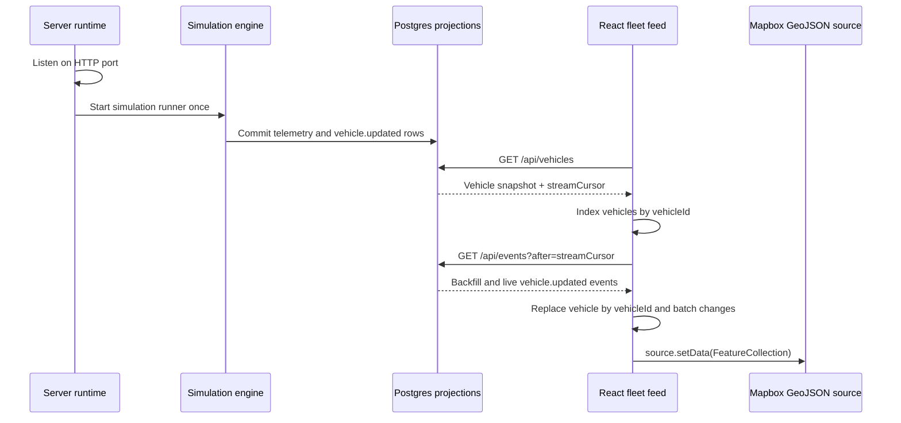

# Web UI and Backend Fleet Map Integration Plan

## Objective

Connect the existing React/Mapbox world-preview application to the running Fleet Radar backend so one local application startup launches the simulator and the browser displays the current locations of approximately 100 vehicles with continuous real-time movement.

This is an integration spike, not the complete operator dashboard. It establishes the browser data flow, reconnect semantics, and Mapbox rendering foundation that later UI features can reuse. The first pass is successful when an operator can open the application, see the fleet appear without starting it manually, and observe vehicle positions and headings change as committed telemetry arrives.

## Scope

### In scope

- Keep simulation startup owned by the server runtime and start it automatically with the application.
- Load a cursor-consistent initial vehicle snapshot from `GET /api/vehicles`.
- Subscribe to committed `vehicle.updated` events through `GET /api/events` after the snapshot cursor.
- Recover correctly from the snapshot-to-stream race, ordinary SSE reconnects, duplicate replacements, and `stream.reset-required`.
- Maintain the current fleet in an indexed browser collection keyed by `vehicleId`.
- Render all vehicles through one Mapbox GeoJSON source and Mapbox layers, not React DOM markers.
- Update the Mapbox source in bounded browser batches rather than once for every telemetry event.
- Show vehicle location, heading, status, and stale state directly on the map.
- Preserve the Las Vegas service-area and service-zone context already rendered by the world spike.
- Replace the static-world preview chrome with a minimal map-first shell showing connection state and visible fleet count.
- Support both same-origin production/Compose execution and the existing Vite development proxy.
- Add unit, component, integration, and opt-in visual tests for initial load, real-time movement, reset, reconnect, and cleanup.

### Out of scope for this pass

- Route geometry overlays, including the approximately 10 `EN_ROUTE` routes.
- Vehicle selection and detail panels.
- Fleet tables, search, filters, KPI cards, low-battery workflows, and coverage analysis.
- Dispatch-job presentation or operator mutation controls.
- Starting, pausing, resetting, or configuring the simulation from the browser.
- Adding WebSockets, GraphQL, polling as a parallel live-update transport, or a client state-management library.
- Persisting browser state or Mapbox route data.
- Redesigning the backend event model or adding a second vehicle endpoint.

Those operator features should be added one at a time after this integration foundation is visually and operationally verified.

## Existing Capabilities to Reuse

The implementation should compose the current system rather than introduce another runtime path:

- `createServerRuntime.start()` starts HTTP first and then starts the simulation and dispatch runners.
- The simulator emits telemetry through the shared event boundary.
- `PostgresFleetEventConsumer` commits the event log, current projection, and `projection_update` together.
- `GET /api/vehicles` returns the current fleet and a stream cursor captured in the same repeatable-read transaction.
- `GET /api/events?after=<cursor>` backfills committed projection replacements after that cursor and then continues as SSE.
- Vite proxies `/api` and `/health` during host development.
- Fastify serves the built React application on the same origin in the composed runtime.
- `FleetMap` already creates the Mapbox instance and loads the bounded Las Vegas world assets.

No public `POST /simulation/start` endpoint is required. Browser lifetime must not own simulator lifetime: starting the server starts the simulation once, while opening or refreshing multiple browser tabs only creates additional read-only observers.

Two Mapbox capabilities have different startup effects:

- A public browser token is required to render the Mapbox basemap.
- A server-side Directions-capable token and remaining request budget are required for dispatched/customer routes and therefore visible vehicle movement.

Without Directions access, the simulator still starts and publishes approximately 100 stationary telemetry records, and the fleet map should still populate while routing health is degraded. Movement-focused visual acceptance must run with both capabilities configured. Host development may use the existing public `MAPBOX_TOKEN` compatibility fallback; shared and Docker environments should use the explicit browser and server variables documented in `.env.example`.

## End-to-End Data Flow



The snapshot cursor is the handoff point between batch and stream. The browser must never subscribe from `0` during normal startup and must not open the SSE stream before it has a snapshot cursor.

An empty initial snapshot is valid during the first second of a new database. The browser still subscribes after its returned cursor and fills the indexed collection as the simulator's first telemetry events commit.

## Browser Data Semantics

Define browser-local API contracts under `apps/web/src/api/`. Do not import server repository classes into the browser and do not move REST DTOs into the domain event package merely to share TypeScript declarations.

### `VehicleMapRecord`

The browser's current replacement record for one vehicle:

```ts
type VehicleMapRecord = {
  vehicleId: string;
  coordinate: [longitude: number, latitude: number];
  heading: number;
  batteryPercentage: number;
  status: "FREE" | "WITH_CUSTOMER" | "EN_ROUTE";
  serviceZoneId: string;
  lastOccurredAt: string;
  lastReceivedAt: string;
};
```

Semantic rules:

- `vehicleId` is the stable collection key and Mapbox feature ID.
- `coordinate` is always `[longitude, latitude]`, never `[latitude, longitude]`.
- `heading` is degrees in `[0, 360)`, with `0` representing north.
- `batteryPercentage` remains available as feature metadata for later UI work even though this pass does not add a battery panel.
- `status` is the operational display state and determines the primary vehicle color.
- `lastOccurredAt` is producer time and is informational only.
- `lastReceivedAt` is backend ingestion time and drives browser freshness.
- Each snapshot or stream record is a complete replacement for that vehicle, not a field patch.

The snapshot currently also contains `isStale` and optional route summary data. The map feed should deliberately select only the fields above, then calculate freshness from `lastReceivedAt` and the snapshot's `staleAfterSeconds`. This keeps SSE and snapshot records semantically identical even though the `vehicle.updated` payload does not contain a time-dependent `isStale` boolean.

### `FleetSnapshot`

```ts
type FleetSnapshot = {
  data: VehicleMapRecord[];
  meta: {
    count: number;
    generatedAt: string;
    streamCursor: string;
    staleAfterSeconds: number;
  };
};
```

- `streamCursor` is an opaque decimal string. Do not convert it to a JavaScript `number`.
- `count` describes the snapshot result; the live collection count may change after streaming begins.
- `generatedAt` is response metadata, not vehicle freshness.
- `staleAfterSeconds` is the backend's current freshness rule and must not be duplicated as a hard-coded browser constant.

### Feed connection state

Use a small explicit state machine:

```text
LOADING_SNAPSHOT -> CONNECTING_STREAM -> LIVE
       ^                    |             |
       |                    v             v
       +---------- RETRYING / RESETTING <-+
                              |
                              v
                            ERROR
```

- `LOADING_SNAPSHOT`: no cursor has been acquired.
- `CONNECTING_STREAM`: a snapshot is usable and the SSE connection is opening.
- `LIVE`: the stream has opened; the fleet may still contain fewer than the configured 100 vehicles during startup.
- `RETRYING`: a recoverable snapshot or stream failure is awaiting retry.
- `RESETTING`: `stream.reset-required` closed the old stream and is reloading a fresh snapshot.
- `ERROR`: a bounded retry cycle is exhausted or response validation fails; expose a manual Retry action.

Do not claim the feed is live merely because the Mapbox style loaded. Map readiness and backend-feed readiness are independent states.

## Proposed Web File Layout

```text
apps/web/src/
  api/
    contracts.ts          # Browser DTOs plus small runtime parsers
    fleetApi.ts           # Snapshot request and EventSource construction
  hooks/
    useFleetFeed.ts       # Snapshot/SSE lifecycle and indexed current state
  lib/
    vehiclesToGeoJson.ts  # Pure map projection and freshness calculation
    world.ts              # Existing bounded-world helpers
  components/
    FleetMap.tsx          # Mapbox lifecycle, world and vehicle sources/layers
    FleetConnection.tsx   # Minimal live/retry/count status presentation
  test/
    fleetApi.test.ts
    useFleetFeed.test.tsx
    vehiclesToGeoJson.test.ts
    FleetMap.test.tsx
```

Keep these files focused. Do not add Redux, Zustand, React Query, a generic event bus, or a reusable repository hierarchy for this spike.

## Snapshot and SSE Client

### Initial snapshot

`fleetApi.ts` should:

1. Call same-origin `GET /api/vehicles` with an `AbortSignal`.
2. Require an `ok` response and reject a non-JSON or malformed response with a safe user-facing error.
3. Validate the required envelope, cursor, staleness threshold, vehicle identifiers, coordinate order/ranges, heading, battery, status, and timestamps.
4. Return canonical browser-owned copies rather than retaining arbitrary response properties.
5. Never include a Mapbox or database token in an API URL, error, or log.

Use focused handwritten parsing because the contract is small. Adding a schema framework only for this response is unnecessary.

### Stream connection

After applying the snapshot atomically, create one native `EventSource` for:

```text
/api/events?after=<encoded snapshot streamCursor>
```

Register named listeners; these are custom SSE event types, so `onmessage` alone is insufficient:

- `vehicle.updated`: parse a `VehicleMapRecord`, replace the indexed record by `vehicleId`, and schedule a render batch.
- `stream.reset-required`: close that `EventSource`, discard its cursor lifecycle, and fetch a complete new snapshot before reconnecting.
- `open`: transition the feed to `LIVE`.
- `error`: transition to `RETRYING` while allowing the native client to reconnect; do not create a second concurrent `EventSource`.

`route.updated`, `route.removed`, and `dispatch-job.updated` are intentionally ignored in this pass. Their presence must not be treated as an error.

Native EventSource automatically sends `Last-Event-ID` on reconnect. The server gives that header precedence over the original `after` query parameter, so ordinary disconnects resume after the newest event applied by that EventSource. Complete replacement events make replay idempotent.

If the connection remains unavailable beyond a small documented threshold, continue native reconnection but show a conspicuous disconnected/retrying state. Do not clear the last known positions; mark them stale as their backend receipt times age.

### Cleanup and Strict Mode

The feed hook must be safe under React development Strict Mode:

- Abort an in-flight snapshot request on cleanup.
- Close exactly the EventSource created by that effect.
- Cancel retry timeouts, stale-refresh timers, and pending animation frames.
- Ignore callbacks from a superseded generation after reset or unmount.
- Never allow two active streams for one mounted feed.

## Browser Fleet Store and Update Batching

Keep current records in `Map<string, VehicleMapRecord>`. A `vehicle.updated` event replaces one entry in O(1) time.

Do not call Mapbox `setData` or trigger a React render for every SSE record. One simulator tick can commit roughly 100 vehicle events in rapid succession. Schedule at most one visible collection update per animation frame:

1. Apply incoming replacements immediately to the mutable indexed ref.
2. If no flush is scheduled, request one animation frame.
3. At the flush, expose one immutable array/snapshot to React and clear the scheduled flag.
4. Convert that array to one GeoJSON `FeatureCollection` and call `setData` once.

At 100 vehicles this is simple; at 1,000 it avoids 1,000 React marker components and a burst of redundant Mapbox source updates. Do not add worker threads, binary transports, or premature spatial indexing.

Recalculate stale state at least once per second even if no telemetry events arrive. A telemetry gap must visibly age into a stale marker without requiring another server event.

## Mapbox Vehicle Rendering

### GeoJSON source

Add one source named `vehicles`:

```ts
type VehicleFeatureProperties = {
  vehicleId: string;
  heading: number;
  batteryPercentage: number;
  status: VehicleMapRecord["status"];
  serviceZoneId: string;
  isStale: boolean;
  lastReceivedAt: string;
};
```

Every feature is a GeoJSON `Point` with `id` and `properties.vehicleId` equal to the application vehicle ID. Generate fresh plain data for `setData`; never expose a mutable record map to Mapbox.

### Layers

Use Mapbox layers instead of `Marker` objects:

- `vehicles-status`: a circle layer with a status-color expression.
- `vehicles-heading`: a small north-oriented triangle/arrow symbol rotated by the `heading` property with map-aligned rotation.

Suggested initial colors should be distinct and documented in the map legend:

- `FREE`: green/teal.
- `WITH_CUSTOMER`: blue.
- `EN_ROUTE`: orange.
- Stale: reduced opacity plus a contrasting outline, regardless of status.

Keep status styling in Mapbox expressions so changing a feature property updates presentation without rebuilding layers. Give vehicle layers a usable minimum radius at the full service-area zoom and modest interpolation when zooming in.

The service-area outline and service-zone layers remain. Hide the existing 200 orange destination points and destination click interaction in this pass because they visually compete with the vehicle layer and are no longer the primary task. Destination data remains in the world catalog for simulation and later dispatch/selection features.

### Map and data lifecycle

Snapshot/SSE data may arrive before the Mapbox `load` event, and Mapbox may load before the first vehicle. `FleetMap` must support both orders:

- Create world and vehicle sources/layers once after Mapbox style load.
- Initialize `vehicles` with an empty `FeatureCollection`.
- When vehicle props change after load, get the existing source and call `setData`.
- When vehicle props already exist at load, set them immediately after source creation.
- Remove the map and event handlers on unmount.

Do not recreate the Mapbox instance when fleet records or callback identities change.

## Minimal UI for the Spike

Replace the current destination-selection sidebar and “World preview” language with a map-first shell:

- Application title.
- Connection state: Starting, Live, Reconnecting, Stale/Disconnected, or Error.
- Current vehicle count, such as `100 vehicles`.
- A small map legend for the three statuses and stale treatment.
- Existing missing-public-token and Mapbox-load error states.
- A backend error overlay or banner with a Retry action that does not destroy an already loaded map.

Do not add vehicle details, filters, route toggles, job cards, or operational controls in this pass. The layout should leave room for later panels without pretending they are implemented.

Accessibility requirements for this minimal shell:

- Announce connection-state changes through a restrained `aria-live` region.
- Do not use color alone for connection health; pair it with text.
- Keep the vehicle count available as text for operators and automated tests.
- Keep errors readable when Mapbox is unavailable.

## Backend and Runtime Work

No new endpoint or service is expected. Confirm and protect the following existing behavior with integration tests:

1. `apps/server/src/main.ts` creates one runtime and starts it once.
2. HTTP begins accepting requests before producers start.
3. Simulation emits the first fleet telemetry without a browser command.
4. A new database may return an empty snapshot, followed by 100 streamed vehicle replacements.
5. A populated database returns current records immediately and continues sequences above persisted maxima.
6. The built React assets, REST API, and SSE endpoint remain same-origin.
7. Missing Directions credentials may degrade routing but must not stop stationary/moving telemetry, Postgres, REST, or the vehicle map feed.

If a test exposes a payload mismatch, make the smallest backend correction to the existing `vehicle.updated` replacement DTO. Do not create a frontend-specific event path.

## Failure and Recovery Behavior

### Snapshot failure

- Preserve the Mapbox/world state if it has loaded.
- Retry with a short capped delay suitable for local startup.
- After the bounded automatic attempts, show Error and a manual Retry action.
- Never open SSE without a valid snapshot cursor.

### Stream interruption

- Retain last known vehicles.
- Show Reconnecting rather than Live.
- Let native EventSource reconnect with `Last-Event-ID`.
- Continue local staleness aging while disconnected.

### Retention reset

- Close the current stream immediately on `stream.reset-required` so it does not reconnect in a loop.
- Fetch and atomically replace the entire collection with a fresh snapshot.
- Open a new stream only after applying the new cursor.

### Malformed data

- Reject the malformed snapshot as a feed error rather than plotting partial arbitrary data.
- Ignore an individual malformed stream event, record a safe diagnostic without its raw payload, and remain connected.
- Do not allow invalid coordinates or `NaN` values to reach Mapbox.

### Mapbox failure

- Keep the backend feed lifecycle independent so the UI can still report the current vehicle count and connection state.
- Show the existing actionable public-token or map-load message.
- Never fall back to exposing the server Directions token in the browser.

## Testing Plan

### Pure unit tests

Add tests for:

- Valid snapshot parsing and canonical field selection.
- Rejection of invalid cursor, coordinate order/range, heading, battery, status, and timestamps.
- `VehicleMapRecord` to GeoJSON conversion.
- Status and stale properties.
- Fresh-to-stale transition based on backend `lastReceivedAt` and `staleAfterSeconds`.
- Idempotent replacement by `vehicleId`.

### Feed-hook tests

Use mocked `fetch`, `EventSource`, timers, and animation frames to prove:

- Snapshot data is installed before the stream opens with its cursor.
- An empty snapshot fills from later `vehicle.updated` events.
- A burst of 100 events schedules one visible flush.
- Coordinate and heading replacements update the existing vehicle rather than adding a duplicate.
- Named SSE events are used.
- Ordinary errors do not create parallel streams.
- `stream.reset-required` closes the old stream, reloads a snapshot, and reconnects from the new cursor.
- Cleanup aborts requests, closes the stream, and cancels timers/frames.
- Malformed single stream records are ignored safely.

### Map component tests

Extend the Mapbox mock to verify:

- The world and vehicle sources/layers are added once.
- The vehicle source begins empty when telemetry has not arrived.
- Preloaded vehicles are applied after map load.
- Later vehicle batches call `setData` without recreating the map.
- Heading and status expressions are configured on layers.
- The map is removed on unmount.
- Missing browser token does not initialize Mapbox but does not crash the rest of the shell.

### Backend integration tests

Against disposable real Postgres:

- Start the runtime with deterministic fake routing and a small fleet configuration.
- Observe an initial snapshot and its cursor.
- Advance or start the simulation and read `vehicle.updated` events after that cursor.
- Prove the streamed coordinate/heading values match the later REST projection.
- Prove a simulated stream-retention reset can be recovered by a new snapshot.

### Browser and visual QA

Keep browser tests opt-in because real Mapbox GL needs a public token:

1. Configure a public browser token and a server-side Directions-capable token, then start the composed application or a server-backed Vite session.
2. Wait for `data-map-ready="true"` and visible Live state.
3. Wait until the visible fleet count reaches the configured vehicle count, normally 100.
4. Confirm the map contains vehicle features inside the Las Vegas service area.
5. Observe at least one vehicle coordinate or rendered position change across telemetry intervals.
6. Confirm status colors, heading indicators, and stale styling remain readable at service-area and street zooms.
7. Disconnect/restart the application server and verify the UI shows reconnecting/stale state, then returns to Live without duplicating vehicles.
8. Test desktop and narrow layouts.
9. Capture one screenshot for final visual inspection.

Default unit tests must not call Mapbox or depend on a live token.

## Security and Operational Constraints

- Browser API requests remain same-origin and contain no credentials.
- Only a public `pk.*` Mapbox token may enter the Vite/browser build.
- `MAPBOX_DIRECTIONS_ACCESS_TOKEN`, database URLs, and Postgres credentials must never be referenced by web source code.
- Do not log raw SSE payloads, token-bearing URLs, or backend error bodies.
- Close all browser connections on unmount to avoid multiplying SSE clients during development.
- Use the server-provided stream cursor and staleness threshold; do not invent browser offsets or freshness policy.
- Keep vehicle rendering as Mapbox source data so the same approach remains reasonable for approximately 1,000 vehicles.

## Documentation Updates

After implementation:

- Update `plans/ARCHITECTURE.md` to describe the implemented browser snapshot/SSE state flow and batched GeoJSON source, if the final code differs from its current high-level description.
- Update `README.md` so the primary run path explains that the simulation starts automatically and the map should populate to approximately 100 vehicles.
- Document the Live/Reconnecting/Error states and public Mapbox token requirement.
- Record route overlays and the remaining dashboard controls as the next incremental UI work, not as completed functionality.

## Execution Order

1. Add browser API DTOs and exact parsers for the fleet snapshot and `vehicle.updated` replacement.
2. Add the snapshot client and native EventSource construction behind a small testable interface.
3. Implement `useFleetFeed` with snapshot-first cursor handoff, indexed replacements, reset recovery, cleanup, and connection state.
4. Add animation-frame batching and periodic stale-state refresh.
5. Add the pure vehicle-to-GeoJSON converter.
6. Refactor `FleetMap` to accept vehicle data while keeping one stable Mapbox instance.
7. Add the empty `vehicles` source, status circle layer, and heading symbol layer.
8. Remove destination-point rendering/click behavior from the default view while preserving service-area and zone context.
9. Replace the static preview sidebar with the minimal connection/count/legend shell.
10. Add parser, feed-hook, batching, reset, stale, and Mapbox component tests.
11. Add the real-Postgres runtime integration test for initial telemetry and subsequent movement.
12. Extend the opt-in browser smoke test to wait for Live and 100 vehicle features.
13. Run unit tests, real-Postgres tests, production builds, Compose configuration, and Docker smoke.
14. Perform Mapbox visual QA and verify movement, heading, status, stale, reconnect, and responsive behavior.
15. Reconcile `ARCHITECTURE.md` and `README.md` with the final implementation.

## Acceptance Criteria

- Starting the server or Docker Compose starts one simulation without a browser action.
- Opening the application loads a snapshot and subscribes after its matching cursor.
- A fresh database progresses from zero to the configured fleet count through streamed replacements without a reload.
- The map displays approximately 100 unique vehicles inside the bounded Las Vegas world.
- Vehicle positions and headings visibly update from committed telemetry in real time.
- `FREE`, `WITH_CUSTOMER`, and `EN_ROUTE` vehicles are visually distinguishable.
- Vehicles become visibly stale according to backend receipt time even when no new event arrives.
- One Mapbox GeoJSON source and layer set renders the fleet; there is no DOM marker per vehicle.
- A telemetry burst produces bounded Mapbox/React updates rather than one render per event.
- Snapshot-to-stream races, automatic reconnect, duplicate replacement, and retention reset do not lose or duplicate vehicles.
- Last known locations remain visible but stale while the backend stream is unavailable.
- Missing Mapbox credentials do not expose a server token or crash the backend feed.
- No route, dispatch, filter, table, or selection UI is added in this pass.
- Default tests, real-Postgres integration tests, production builds, Compose validation, Docker smoke, and opt-in visual QA pass.

## Next Interactive UI Candidates

After this plan is complete, choose the next dashboard addition through discussion rather than implementing all of them at once. Candidates include selected-vehicle detail, stale filtering, dispatch-job visibility, zone coverage, and operator intervention workflows.

### Completed follow-up: status and battery filters

The first post-spike dashboard increment adds client-side status checkboxes and a combinable battery-below-20% filter beneath the map legend. Filtering affects only the Mapbox vehicle source; the complete snapshot and real-time feed remain resident in the browser so hidden vehicles continue receiving updates.

### Completed follow-up: active route and destination overlays

The next increment retains active-route summaries from snapshots and named route SSE events, fetches ephemeral geometry from the vehicle detail endpoint when a route appears, and renders all visible `EN_ROUTE` paths in one GeoJSON line source. A separate point source places the persisted catalog destination and name at each route endpoint. Route removals clear both overlays, and client-side vehicle filters apply to the vehicle, route, and destination sources together.
